# CC WebUI

[简体中文](README.md) | **English**

A local web interface for using Claude Code in your browser, built on the [Claude Agent SDK](https://github.com/anthropics/claude-agent-sdk-typescript).

```text
Browser (React)  ⇄  WebSocket  ⇄  Local Node server (127.0.0.1 only)  ⇄  Agent SDK  →  Claude Code
```

Sessions, authentication, CLAUDE.md, settings, plugins, skills, and MCP reuse your local Claude Code configuration (`~/.claude`).
Continue a session from the terminal in the browser, or switch back to the terminal later.

Manage projects and conversations, select models, reasoning effort, and permission modes, and inspect tool activity, context usage, and per-turn cost estimates in one interface.

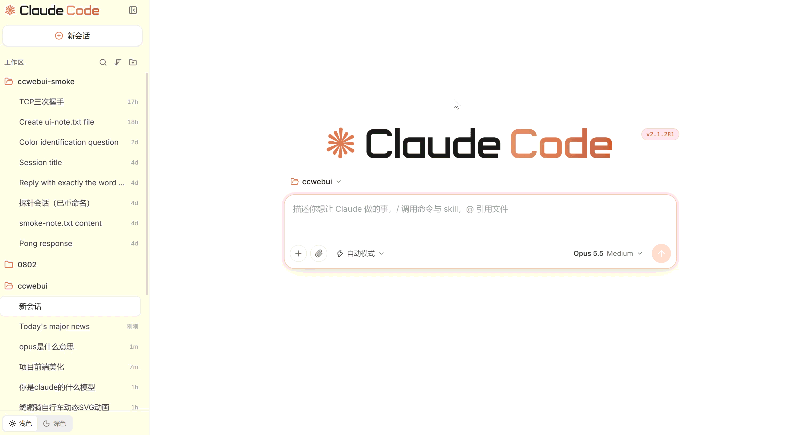

## Contents

- [Requirements](#requirements)
- [Getting started](#getting-started)
- [Features](#features)
- [Security](#security)
- [Project structure](#project-structure)
- [Version compatibility](#version-compatibility)
- [Smoke test](#smoke-test)
- [Known limitations](#known-limitations)

## Requirements

- Node.js ≥ 22.18. The server runs TypeScript directly and does not require compilation.
- Claude Code must be authenticated on your machine. If `claude` works in your terminal, you are ready to go.

## Getting started

```bash
npm install
npm run build     # Build the frontend
npm start         # Start the server
```

Open `http://127.0.0.1:8787` in your browser. No access token is required by default.

To require an access token, start the server with `npm start -- --token`. A token is generated on first use and saved to `~/.ccwebui/token`.
The terminal prints a link containing the token. Open it once and the browser remembers the token.

After changing frontend code, run `npm run build` again. After changing server code, restart `npm start`.

For development with frontend hot reload:

```bash
npm run dev       # Start the backend (8787) and Vite (5173); open the frontend link printed in the terminal
```

Optional arguments: `npm start -- --port 9000`, `--token` to enable token authentication, and `--debug` to print the Claude Code process's stderr in the terminal.

Environment variables:

- `CCWEBUI_PORT`: server port. The Vite proxy follows this setting in development mode.
- `CCWEBUI_TOKEN`: enables token authentication and supplies a temporary token without changing the token file.

Run type checks with `npm run typecheck`.

## Features

### Home screen and project selection

Opening the page, choosing New session (`新会话`), or entering `/clear` shows the Claude Code logo and a large composer in the center of the page.
Choose a project folder above the composer. Sending the first message switches to the conversation layout.

### Composer and shortcuts

| Location | Control |
|---|---|
| Bottom-left `+` | Skills list, plugin management, and attachments. Selecting a skill inserts it at the beginning of the message. |
| Bottom-left 📎 | Attach images or text files. You can also paste or drag files into the composer. |
| Bottom-left permission button | Ask every time (default), accept edits automatically, plan mode, or full permissions. Full permissions bypasses all confirmations and shows a red notice above the composer. Auto mode is not offered: its classifier requests are not covered by Claude Code's new billing arrangement when using a third-party API gateway. |
| Bottom-right ring | Context window usage. Open it for a breakdown and a Compact button that sends `/compact`. The indicator turns yellow at 70% and red at 90%. |
| Bottom-right model button | Model and reasoning effort: Auto / Low / Medium / High / Extra High / Max. These can be changed during a conversation. |
| Send button | Enter to send, Shift+Enter for a new line. While Claude is working, the button becomes an interrupt control. |

Type `/` to open the command and skill menu; commands that only work in the terminal are hidden automatically.
Type `@` to browse project files. In Git repositories, suggestions respect `.gitignore`, and selecting a directory lets you browse further into it.

`/clear`, `/new`, `/model`, and `/effort` are handled by the web interface and stay in sync with the selectors at the bottom right.

### Models and reasoning effort

Click the model button at the bottom right of the composer to choose both the model and reasoning effort in one menu, without returning to the terminal.
Effort levels include Auto / Low / Medium / High / Extra High / Max; the available options depend on the model. You can adjust them during a conversation.
Changes made through `/model` and `/effort` are reflected in the selectors.

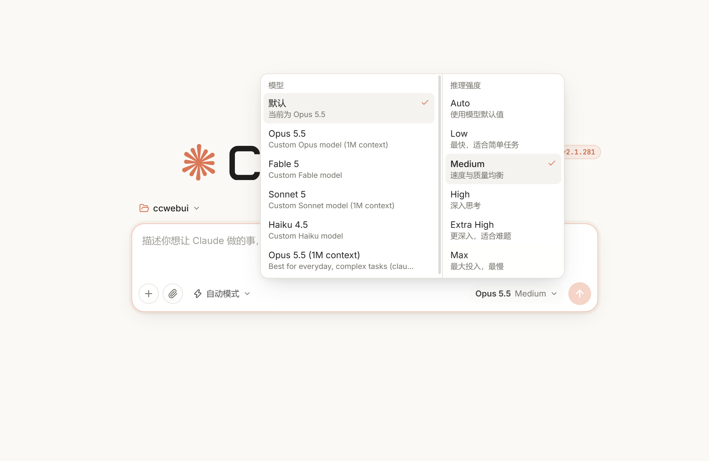

### Context usage and compaction

The ring below the composer shows how much of the context window is in use. Open it to inspect the usage breakdown, used tokens, and window capacity,
and decide whether the conversation needs compaction. The indicator turns yellow at 70% and red at 90%.

The Compact (`压缩`) button sends `/compact`. It is available when the conversation has content and Claude is idle.

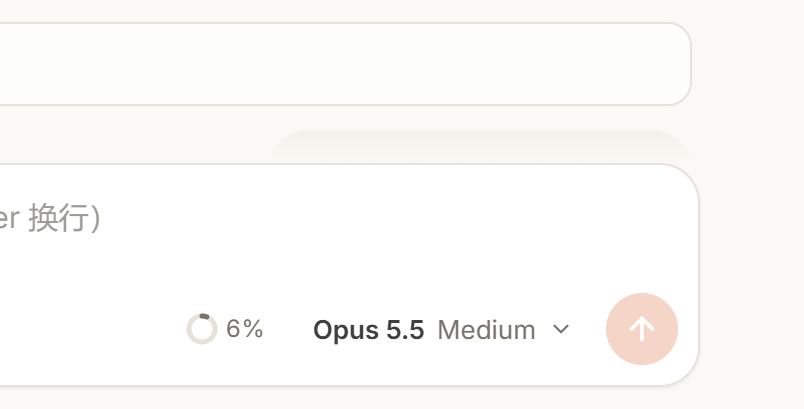

### Sidebar and session management

- Browse session history in a folder → session tree. Folders can be collapsed, hidden, or sorted by recent use or name.
- The folder button next to Workspace (`工作区`) opens the system folder picker: Explorer on Windows, Finder on macOS, and zenity or kdialog on Linux. It starts in the parent of the current project directory. If the window is hidden, use Reopen (`重新弹出`); if a picker is unavailable, enter the path manually. Open another folder (`打开其他文件夹…`) on the home screen works the same way.
- Each session's `…` menu supports renaming, tags, branching into a new session, and deletion with confirmation.
- Search with Ctrl+K across titles, tags, folder names, and full conversation text, with matching snippets highlighted.
- Switch between light and dark themes at the bottom left; the preference is remembered. Collapse the sidebar from the top left.
- An orange dot marks a running session. A yellow dot indicates that a session is waiting for your confirmation.

Shortcuts: Ctrl+K to search, Ctrl+Shift+O for a new session.

#### Delete an individual session

Choose Delete from a session's `…` menu to open a confirmation prompt. Confirming removes the corresponding conversation history from disk and cannot be undone.
The operation applies to the selected session, so you can remove conversations you no longer need.

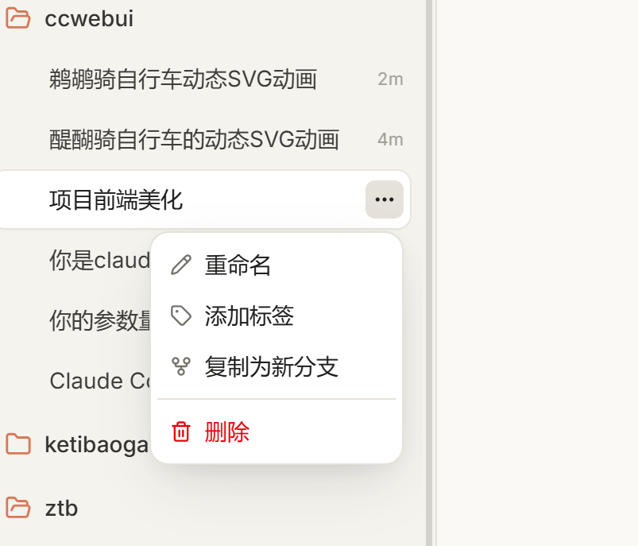

### Conversations and content rendering

#### Markdown and tables

Responses stream into the conversation and support Markdown, syntax highlighting, and table rendering.
Tables appear as rows and columns directly in the conversation, while code is displayed in highlighted code blocks.

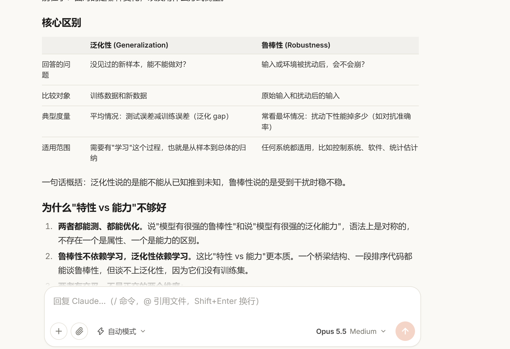

#### SVG previews

Use the preview button at the top right of an SVG code block to switch between source code and the rendered result, without leaving the conversation.
Previews use an `` element, so scripts inside the SVG do not execute and external resources are not loaded.

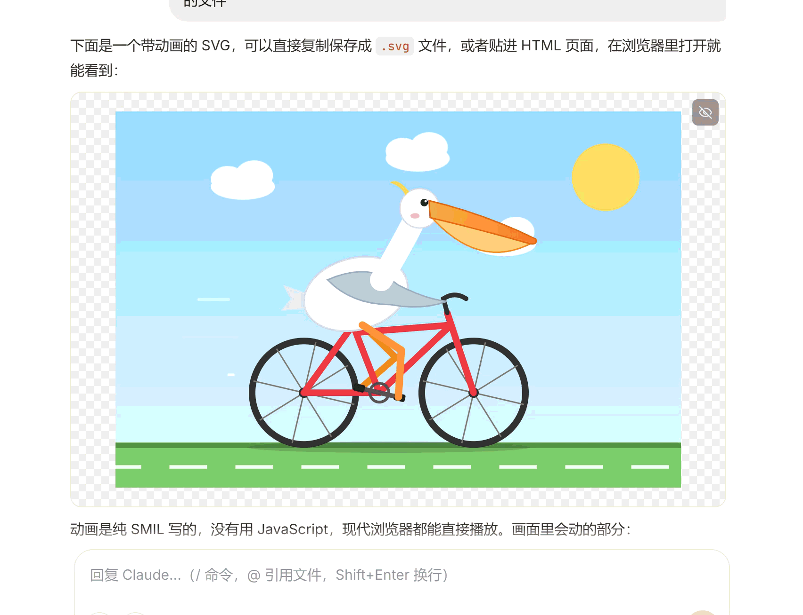

#### Tool call cards

Tool activity appears in separate cards so you can read the response and the execution details independently:

- Bash / PowerShell: terminal calls and output.
- Edit / Write: diffs for file changes.
- Read / Grep / Glob: file reads and searches.
- Subagents and task lists: nested execution details and task progress.

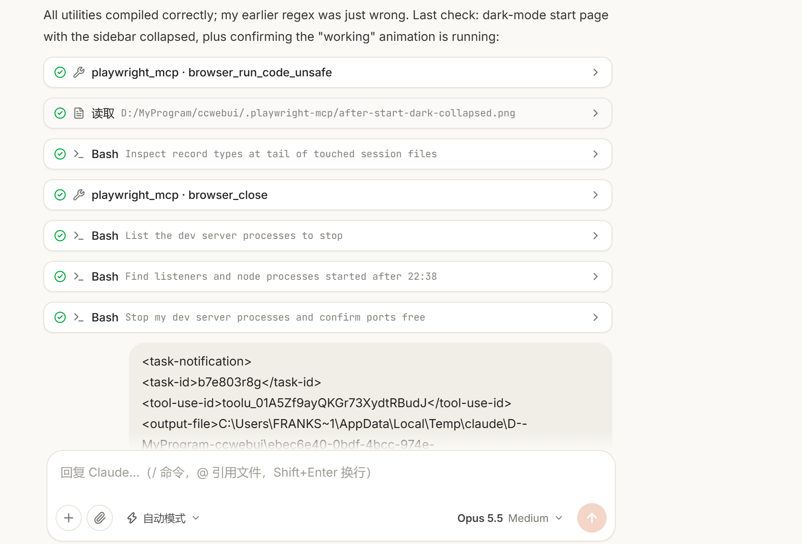

#### CLI-style status messages

While Claude is working, the conversation displays Claude Code CLI-style status words alongside elapsed time, tokens, and reasoning effort,
for example: `✻ Cascading… (40s · ↓ 1.7k tokens · thinking with xhigh effort)`.

Two examples of the running status display:

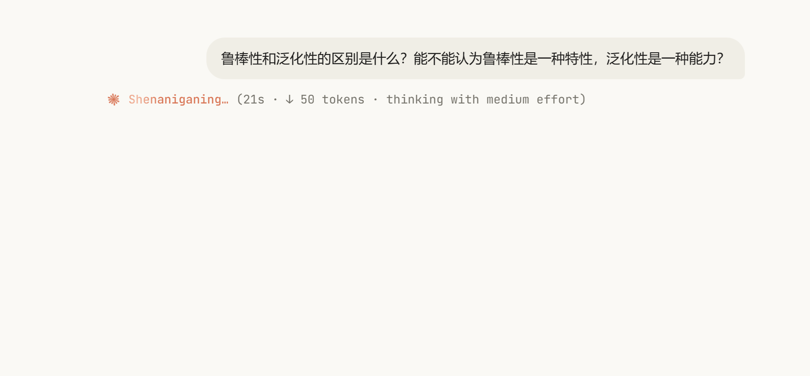

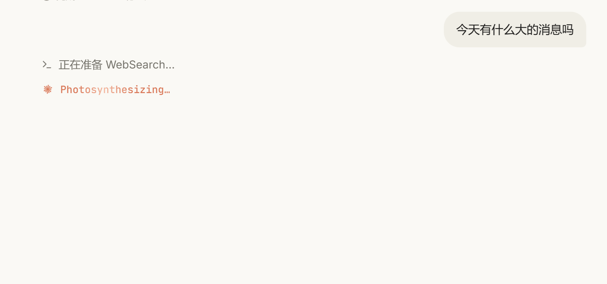

#### Token usage

After each turn, a statistics line shows input and output token counts, elapsed time, and the number of turns.
Hover over it for cache read and write details.

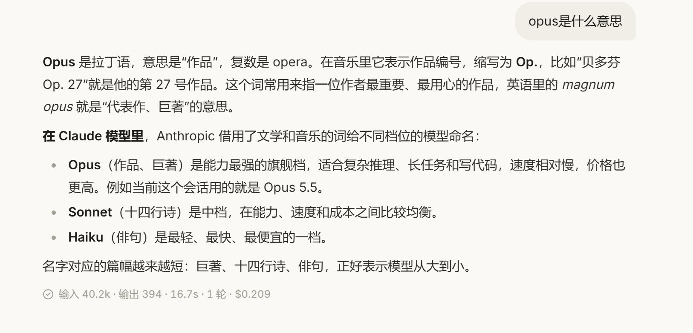

#### Per-turn and cumulative costs

The statistics line shows both the current turn's cost and the cumulative cost for the session, so you can compare a single interaction with the conversation as a whole.
For example, a line may show 41.9k input tokens, 49 output tokens, 1.8 seconds, 1 turn, $0.005 for the turn, and $0.103 in total.

These are estimates based on API prices, not an actual bill. When you sign in with a subscription account, you are not billed per token.

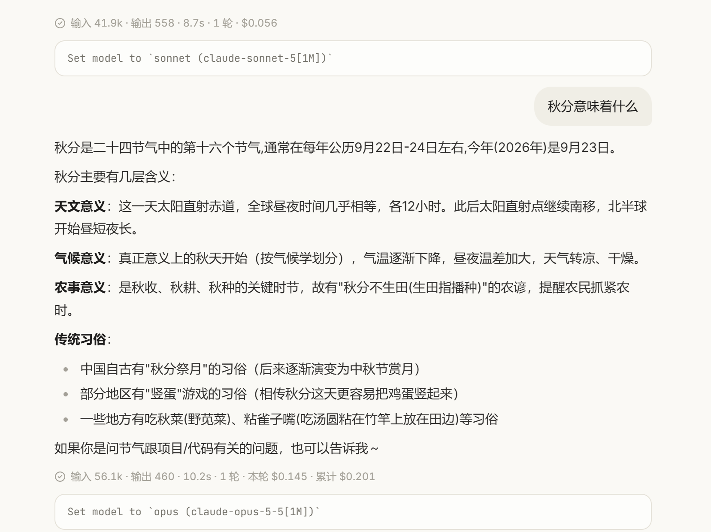

#### Editing, history, and system messages

- Edit and resend: hover over a previous prompt and click the pencil icon. This branches into a new session from just before that prompt and places the original text back in the composer. The original session is preserved.
- Slash-command output from history, such as `/context` tables, is displayed when a session is restored.
- API retries, automatic denials, and other system notices appear in the conversation.

### Permission modes and approvals

Choose Claude's permission mode directly below the composer: ask every time (default), accept edits automatically, plan mode, or full permissions.
Full permissions (`完全权限`) bypasses all confirmations and displays a red notice above the composer.

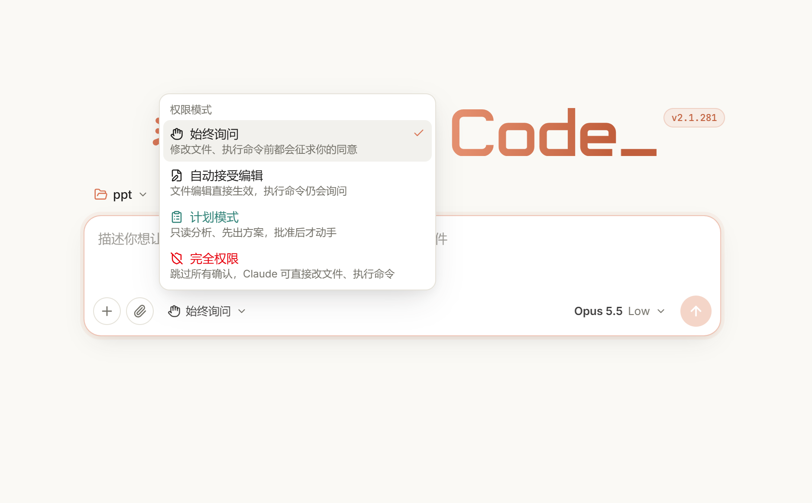

Operations requiring confirmation appear in an approval panel within the conversation:

- Tool calls: allow, always allow for this session, or deny. You can include instructions with a denial. Edit and Write show a diff.
- Claude's questions (`AskUserQuestion`): choose an option or enter your own answer.
- Plan approval: approve and automatically accept edits, approve with confirmation for each action, or provide feedback to revise the plan.

### Skills and plugins

#### Shared entry point

The `+` menu at the bottom left of the composer provides access to Skills, plugin management, and attachments, so you can select them directly from the conversation interface.

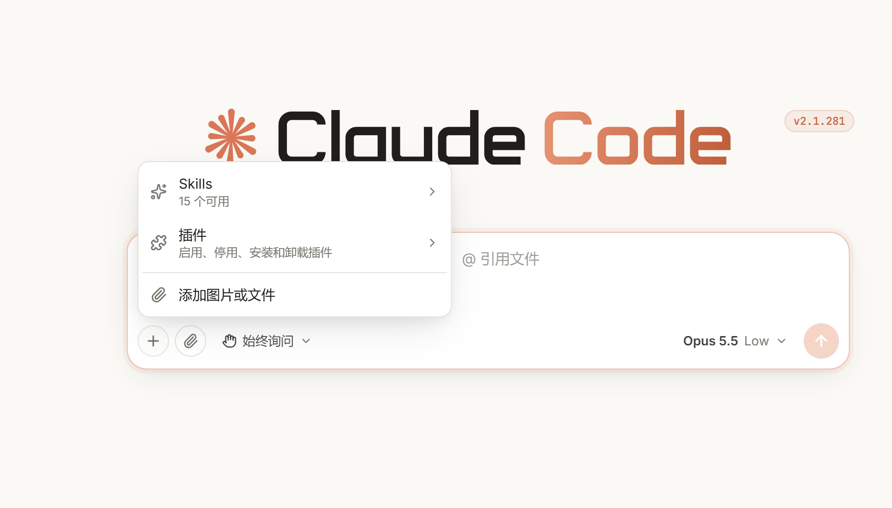

#### Choose a skill

Select a skill from the Skills list to insert it at the start of the message, then add your request and send it.
You can also type `/` to open the command and skill menu.

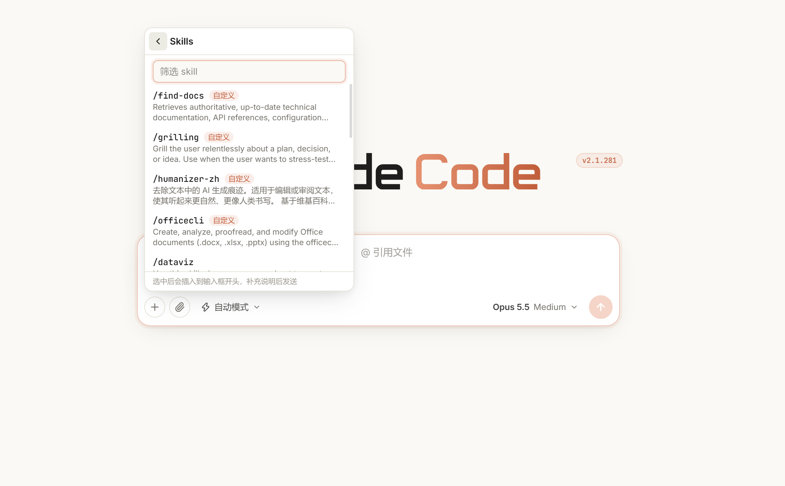

#### Plugin management and marketplaces

Manage plugins through `+` → Plugins (`插件`). Changes are written to your Claude Code user settings, also apply in the terminal, and reload automatically in the current session:

- Installed plugins: enable, disable, or uninstall.
- Marketplaces: browse plugins from configured marketplaces, sorted by install count, with search and installation support. Update marketplaces (`更新市场`) fetches the latest catalogs from GitHub and other sources and requires an internet connection.
- Some plugins require a marketplace-declared command to run locally during installation. The command is shown first and only runs after confirmation.

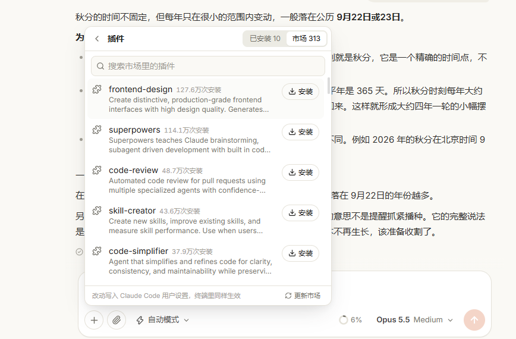

### Multiple sessions

Work continues in the background when you switch to another conversation. Disconnected clients reconnect automatically.
Idle Claude Code processes are reclaimed after a while and restored when you send another message.

## Security

- The server only listens on `127.0.0.1` and validates the Host header to protect against DNS rebinding.
- REST and WebSocket requests validate their origin using the browser's `Origin` and `Sec-Fetch-Site` headers. Requests from other websites are rejected, preventing them from invoking the local service through your browser.
- No access token is required by default, so any local program can access the port. If you share the computer or run software you do not trust, enable token authentication with `--token`.
- This service can execute commands as your user. Do not expose it directly to the public internet. Use an SSH tunnel or Tailscale for remote access.
- SVG previews use ``; embedded scripts do not execute and external resources are not loaded.

## Project structure

```text
shared/protocol.ts        Shared frontend/backend message types
server/src/
  index.ts                HTTP + WebSocket server, access validation, message dispatch
  live.ts                 One Claude Code process per live session via Agent SDK query:
                          streaming, permissions, costs, and context usage
  api.ts                  REST APIs for sessions, renaming, tags, branching, deletion,
                          search, file suggestions, and plugins
  history.ts              Read session history from disk and restore system messages
                          and cost totals omitted by the SDK
  search.ts               Full-text session search
  files.ts                @ file suggestions
  picker.ts               System folder picker, opened by the local server because
                          the browser cannot obtain a folder's full filesystem path
  plugins.ts              Plugin management through the bundled Claude CLI
  auth.ts / static.ts     Host, origin, and token validation / frontend static files
web/src/
  lib/store.ts            Frontend state (zustand) and WebSocket message handling
  lib/transcript.ts       Convert SDK messages into conversation entries
  components/             UI components: ChatView, Composer, Sidebar, Transcript,
                          PermissionPanel, PluginsPanel, ContextMeter, and more
scripts/smoke.ts          End-to-end smoke test
docs/screenshots/         Feature screenshots shared by both README versions
```

## Version compatibility

`@anthropic-ai/claude-agent-sdk` is pinned to `0.3.281`, which corresponds to Claude Code `2.1.281`.
The SDK bundles the matching Claude Code executable, used for both sessions and plugin commands. Upgrade them together.

## Smoke test

Once the server is running, use the following script for an end-to-end check. It calls Claude and incurs a small amount of usage:

```bash
node scripts/smoke.ts <port> <test-directory> [token]   # A token is only needed when the server uses --token
```

## Known limitations

- Context usage follows the terminal's `/context` accounting. At the start of a conversation, Claude Code slightly overestimates fixed overhead such as the system prompt and tool definitions, so the conversation-message portion may be near zero. The estimate approaches actual usage as the conversation grows.
- Historical session files do not store per-turn statistics. When restoring a session, earlier turns do not show token counts or costs.
- New sessions created in the web interface use `entrypoint: "ccwebui"` and appear in the terminal's `/resume` list. Web sessions created before September 29, 2026 used `sdk-ts` and are hidden by Claude Code's `/resume` list. Open those from the corresponding project directory with `claude --resume <session-id>`. The session ID is the `.jsonl` filename under `~/.claude/projects/<project>/`.
- Mobile and narrow-screen layouts are not implemented.
- The interface is currently available in Chinese only; this English README does not change the UI language.
